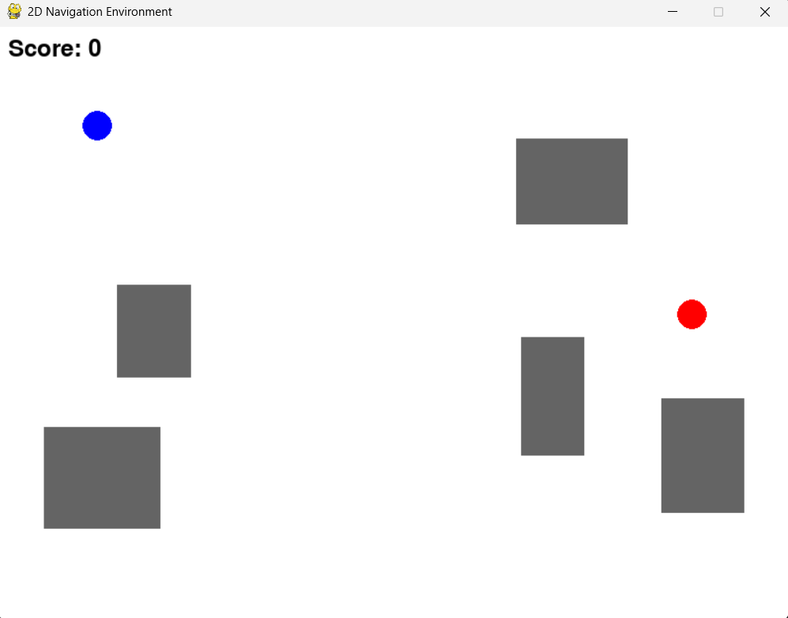

# 2D-NAVIGATION-ENVIRONMENT
2D navigation environment with manual controls.To be expanded upon.


# 2D Navigation Environment

A simple 2D navigation simulation built using Python and Pygame.

## Features

- Blank 2D environment
- Movable circular agent
- Static/random target
- WASD controls
- Boundary checking
- Multiple randomly generated obstacles
- Obstacle collision detection
- Target collision detection
- Score counter
- Safe target spawning

## Technologies

- Python
- Pygame

## Installation

```bash
pip install -r requirements.txt
```

## Run

```bash
python environment.py
```

## Controls

| Key | Action |
|------|--------|
| W | Move Up |
| A | Move Left |
| S | Move Down |
| D | Move Right |

## Project Structure

```
environment.py
README.md
requirements.txt
```

## Future Work

- Grid-based environment
- Path planning algorithms (A*, Dijkstra)
- Reinforcement Learning integration
- Gymnasium compatibility
